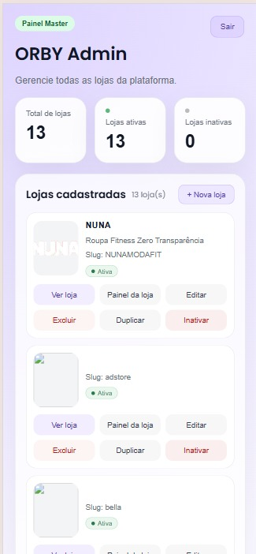
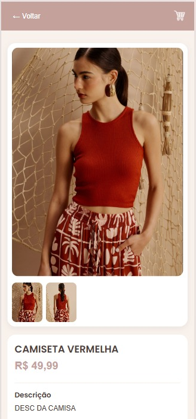
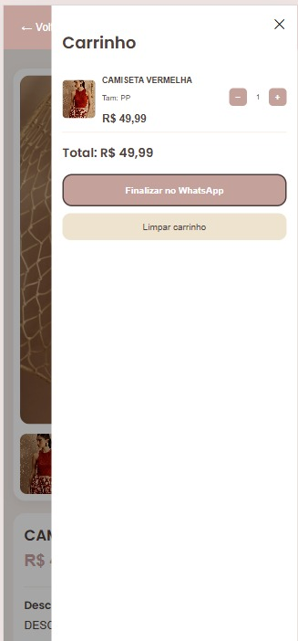
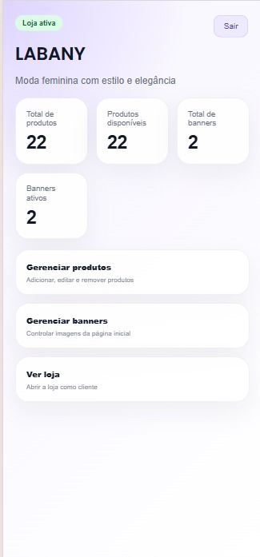

# 🛍️ ORBY — SaaS de E-commerce Multi-Tenant

A ORBY é uma plataforma SaaS de e-commerce desenvolvida para lojas que vendem via Instagram e WhatsApp, oferecendo uma experiência moderna, responsiva e focada em conversão.

---

## 🚀 Tecnologias

- React
- React Router DOM
- Firebase Auth
- Firestore
- Context API
- Cloudinary
- CSS
- Vercel

---

## 🌐 Demonstrações

- [LABANY](https://orbyshop.vercel.app/labany)
- [JMcamisas](https://orbyshop.vercel.app/jmcamisas)

---

## 💡 Funcionalidades

- Estrutura multi-tenant (`/:storeSlug`)
- Painel administrativo por loja
- Painel central ORBY Admin
- Banner rotativo
- Sistema de filtros
- Carrinho com persistência
- Finalização via WhatsApp
- Temas dinâmicos por loja
- Interface responsiva e mobile-first

---

## 🖼️ Preview

### Multi-Tenant

### Loja

### Produto

### Carrinho

### Painel Administrativo

---

## 🎯 Objetivo

Criar uma solução acessível para lojas que vendem pelas redes sociais, transformando catálogos improvisados em experiências de compra mais profissionais.

---

## 📌 Status

🚧 Em evolução contínua.

---

## 👨‍💻 Autor

Caio Lima