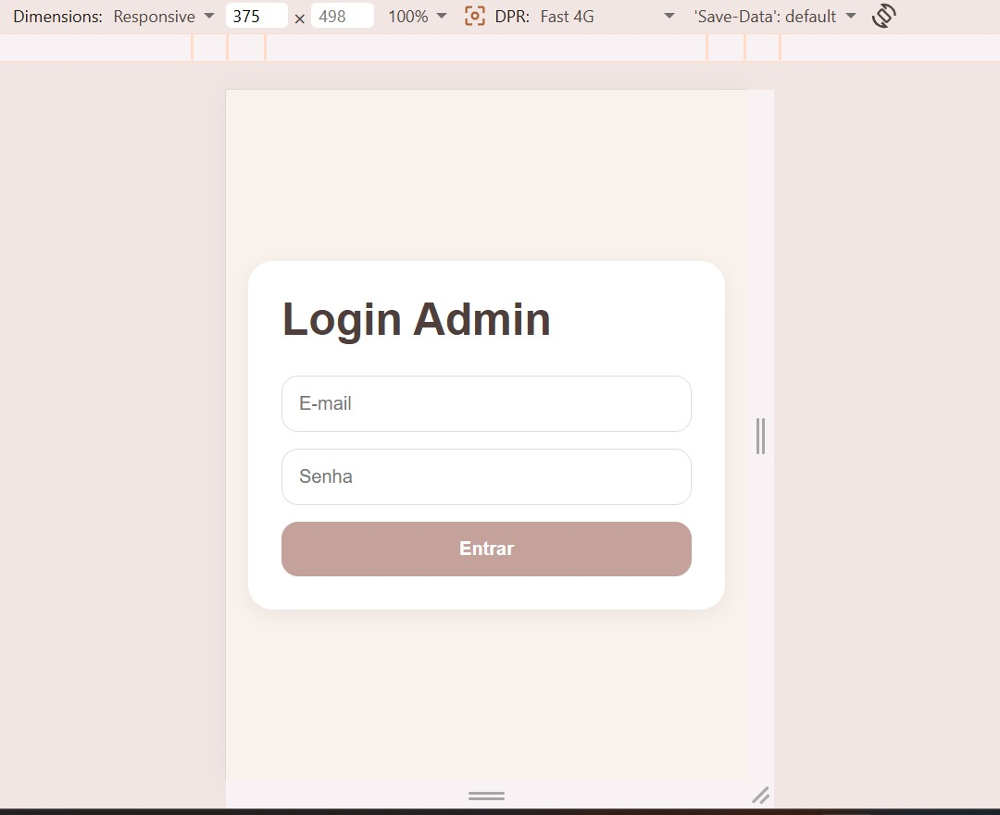
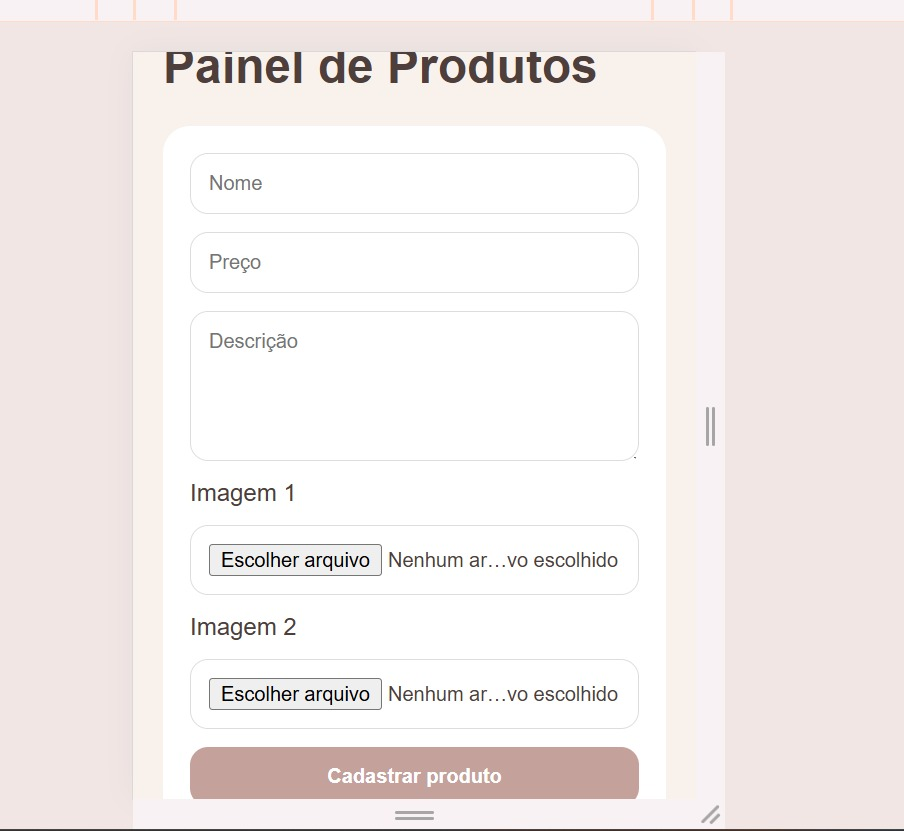
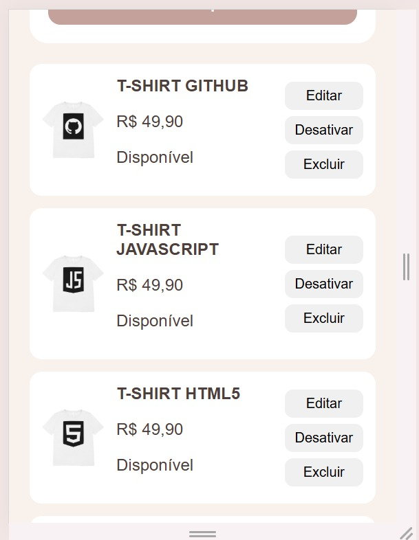
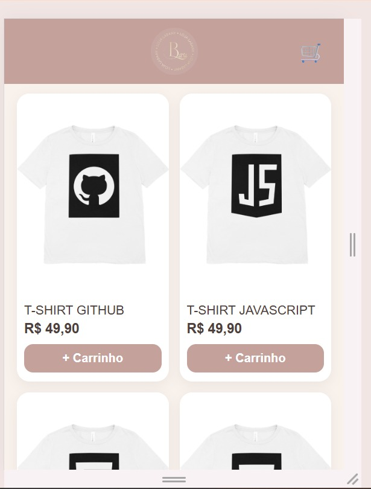
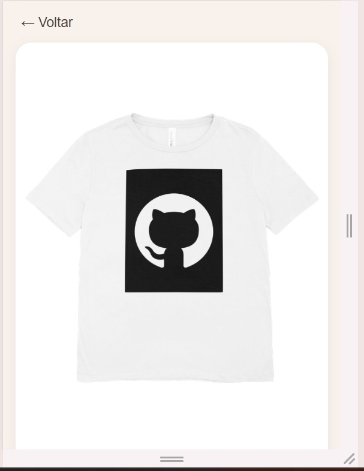
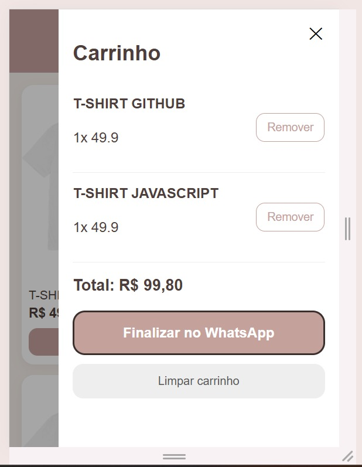

# 🛍️ E-commerce Labany

Projeto completo de e-commerce responsivo, com foco em mobile e painel administrativo para gestão de produtos.

---

## 🚀 Funcionalidades

### 🛒 Loja
- Feed de produtos em layout de 2 colunas
- Página de detalhes com galeria de imagens
- Carrinho de compras funcional
- Finalização via WhatsApp
- Produtos indisponíveis com destaque visual

### 🔒 Admin
- Login com Firebase Authentication
- Proteção de rotas
- Cadastro de produtos
- Upload de imagens (Cloudinary)
- Edição de produtos (incluindo imagens)
- Exclusão de produtos
- Ativar / desativar produtos

---

## 📱 Interface

### 🔐 Login Admin

---

### 📦 Cadastro de Produto

---

### 📋 Lista de Produtos (Admin)

---

### 🛍️ Home (Loja)

---

### 👗 Detalhe do Produto

---

### 🛒 Carrinho

---

## 🧪 Tecnologias

- React (Vite)
- Firebase (Authentication + Firestore)
- Cloudinary (upload de imagens)
- CSS puro